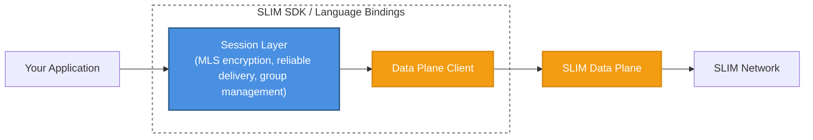

# SLIM SDK

The SLIM SDK provides language-native bindings for building applications that communicate over SLIM. The bindings are generated from the Rust core using [UniFFI](https://github.com/mozilla/uniffi-rs), giving every language identical behaviour with idiomatic APIs.

Each binding bundles two components:

- **Data Plane Client** — connects your application to a SLIM routing node, handles name registration, and routes outgoing messages.
- **Session Layer** — provides end-to-end encryption (MLS), reliable delivery, and session management on top of the data plane client.

## Supported Languages

| Language | SDK guide |
|---|---|
| [Python](./python.md) | `slim-bindings` on PyPI |
| [Go](./go.md) | `github.com/agntcy/slim-bindings-go` |
| [.NET](./dotnet.md) | `Agntcy.Slim` on NuGet |
| [Java](./java.md) | `slim-bindings-java` on Maven Central |
| [Kotlin](./kotlin.md) | `slim-bindings-kotlin` on Maven Central |
| [Node.js](./node.md) | `@agntcy/slim-bindings` on npm |
| [React Native](./react-native.md) | `@agntcy/slim-bindings-react-native` on npm |

See [Installation](./install.md) for per-language package names, requirements, and install commands. Each language guide covers API overview, transport authentication, SLIMRPC, examples, and platform support.

## How It Fits Into SLIM

The following diagram shows where the SDK sits in a SLIM deployment:

Applications never connect to each other directly. They connect to a nearby SLIM routing node and let the SLIM network deliver messages to named endpoints. The SDK handles all the plumbing — TLS connections, name registration, session establishment, and message encryption — so your application logic stays clean.

## SDK Tutorials

Work through the tutorials to learn the fundamentals step by step:

1. [Connecting to SLIM](./tutorials/tutorial-connect.md) — Configure and connect your application to a SLIM node
2. [Creating an App](./tutorials/tutorial-app.md) — Register an application identity and set up message handlers
3. [Creating a Session](./tutorials/tutorial-session.md) — Establish point-to-point and group sessions

## What to Read Next

- [Installation](./install.md) — Install the SDK for your language
- Language SDK guides — [Python](./python.md), [Go](./go.md), [.NET](./dotnet.md), [Java](./java.md), [Kotlin](./kotlin.md), [Node.js](./node.md), [React Native](./react-native.md)
- [Architecture](../../architecture/index.md) — Understand the full SLIM architecture
- [Sessions](../../architecture/sessions/index.md) — Deep dive into session types and the session lifecycle
